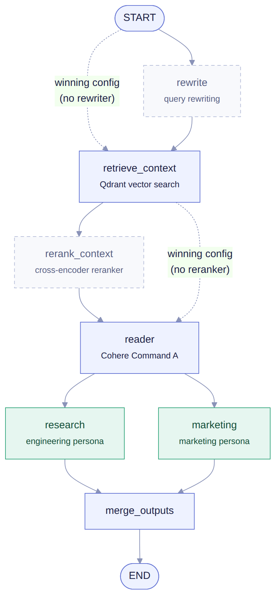
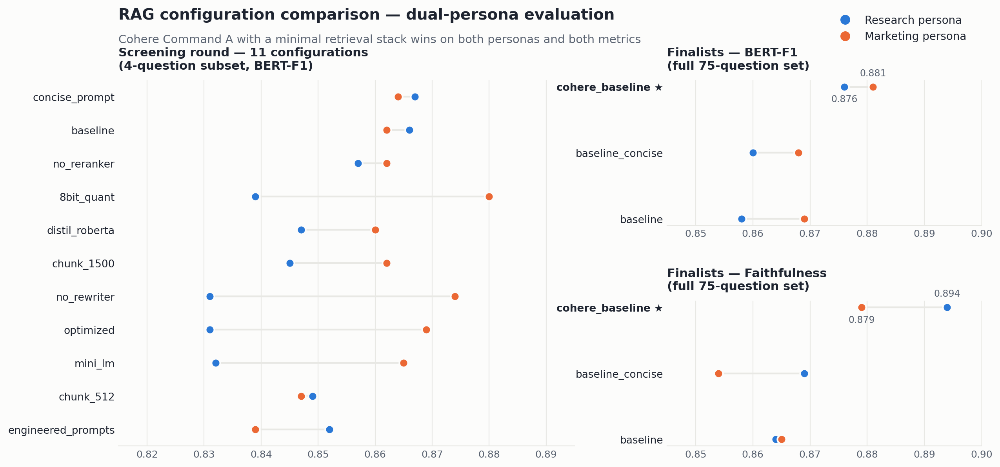

# RAG Evaluation Pipeline

Everyone ships RAG; few measure it. This project builds a retrieval-augmented
generation proof of concept that answers AI/ML questions for **two internal
audiences** — a several-hundred-person engineering org and a 40-person
marketing team — and then evaluates **13 pipeline configurations against 75
labeled question–answer pairs** to find out what actually helps.

Final project for UC Berkeley MIDS DATASCI 267 (Generative AI). Solo work by
Colin Frishberg.

📄 **Read the report:** [`final_report.pdf`](final_report.pdf) ·
📓 **The full pipeline + harness:** [`rag_evaluation.ipynb`](rag_evaluation.ipynb)

## What was tested

The harness varies chunk size, query rewriting, reranking, and generator model
(Cohere `command-a` vs. `command-r` vs. an optimized configuration), scoring
each configuration **per persona** with:

- **BERTScore F1** (roberta-large embeddings) — primary metric
- ROUGE — secondary; less robust for the dual-persona setup
- **Faithfulness** — is the answer grounded in retrieved context?
- Adversarial out-of-domain probes — to catch confident nonsense

## Results

A **minimal stack won**: no query rewriter, no reranker, small chunks, Cohere
Command A —

| Persona | BERT-F1 | Faithfulness |
|---|---|---|
| Engineering | 0.876 | > 0.87 |
| Marketing | 0.881 | > 0.87 |

at under **\$100/month** projected serving cost versus \$1,500+/month for
reserved GPU capacity.

## Limitations worth carrying into production

1. **128-token chunks truncate detail retrieval** — strong aggregate scores,
   shaky on fine-grained questions (e.g., details from Lewis et al. 2020 cut
   off mid-paragraph).
2. **No out-of-domain gate** — irrelevant queries sail through with irrelevant
   context; a relevance/confidence gate is required before trusting the system.
3. LLM-as-judge evaluation and a persistent vector store (Qdrant/Pinecone) are
   the natural next steps.

## Running it

The notebook expects a `COHERE_API_KEY` in the environment (never committed).
Document stores are rebuilt (and cached) on first run.
